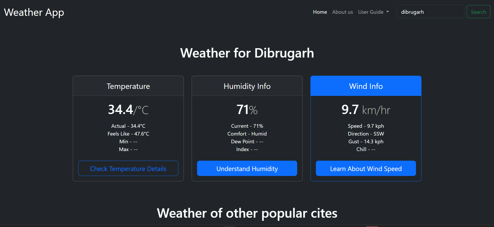
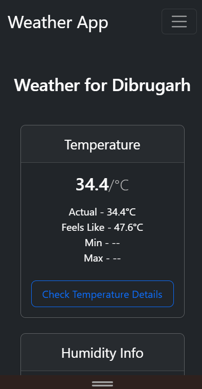
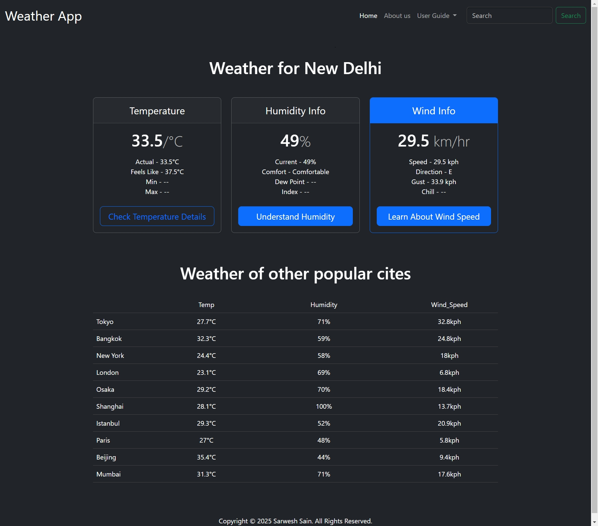

# 🌦️ Weather App

A sleek and responsive Weather App built with **HTML**, **CSS (Bootstrap)**, and **Vanilla JavaScript**. Users can search any city and get real-time weather data using the WeatherAPI.

🔗 **Live Demo:** [https://weather-app-one-tau-16.vercel.app](https://weather-app-one-tau-16.vercel.app)  
📁 **GitHub Repo:** [https://github.com/sarwesh2002/Weather_App](https://github.com/sarwesh2002/Weather_App)

---

## 📸 Screenshots

| Desktop Landing | Mobile Landing |
|-----------------|----------------|
|  |  |

| Full Desktop View | Full Mobile View |
|-------------------|------------------|
|  |  |

---

## 🎥 Demo Video

▶️ [Click here to watch the demo video](./video/weatherApp-demo.mp4)  

---

## 🚀 Features

- Search any city and get real-time weather info  
- Uses [WeatherAPI](https://www.weatherapi.com/)  
- Responsive design for desktop and mobile  
- Clean UI using Bootstrap  
- Live deployment on Vercel  

---

## 🧑‍💻 Tech Stack

- HTML  
- CSS (Bootstrap)  
- JavaScript  
- WeatherAPI  
- Vercel  

---

## 🛠️ How to Run Locally

```bash
git clone https://github.com/sarwesh2002/Weather_App.git
cd Weather_App
Then open index.html in your browser
OR
Use Live Server in VS Code

🔐 API Key
This project uses a free demo API key from WeatherAPI.
If you're using it in production, replace it in script.js:

const apiKey = "d94becc406184c2aa1981224251607";

🙋‍♂️ Author
Sarwesh
GitHub: @sarwesh2002

📄 License
This project is open-source and free to use.

